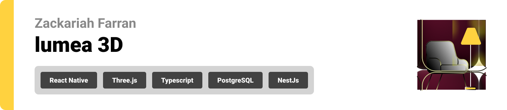
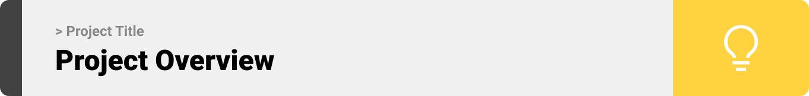
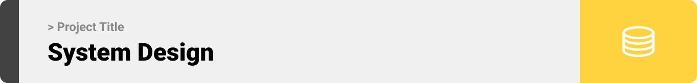
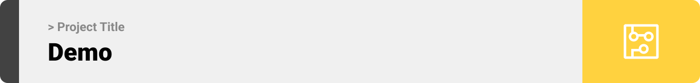
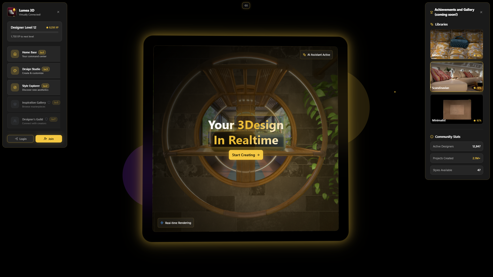
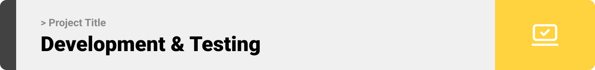
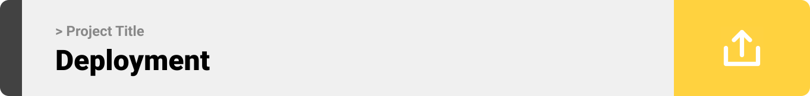

<br><br>

> **Portfolio Notice:** This is a curated public repository showcasing core architecture and technical implementation. For the full production system with proprietary features, please contact me directly.

<!-- project overview -->


Lumea3D delivers synchronized 3D scene collaboration in the browser: multi‑presence camera viewing, fast material/lighting/layout variant suggestions, snapshot safety, and an upcoming pipeline for dataset‑conditioned on‑the‑fly model generation. (Generative helpers are adapter‑driven; core solver not included here.)

**Why it matters:** Fewer static renders. Faster approvals. Shared live context.

**At a glance:** Real-time presence • Variant generation • High‑fidelity WebGL • Inline comments & share links.
<br><br>
<!-- System Design -->

Flow: User action → op broadcast → peers reconcile → scene graph updates. Extensible via AI provider and plugin hooks.

```
┌─────────────────────┐    ┌─────────────────────┐    ┌─────────────────────┐
│   Web Frontend      │    │    API Backend      │    │ AI Generative Svcs  │
│(React/Vite/Three.js)│◄──►│ (NestJS + Swagger)  │◄──►│  (Adapter/External) │
└──────────┬──────────┘    └──────────┬──────────┘    └──────────┬──────────┘
           │                          │                          │
           │                ┌─────────▼─────────┐                │
           │                │    PostgreSQL     │                │
           │                │  + Prisma (ORM)   │                │
           │                └─────────┬─────────┘                │
           │                          │                          │
   ┌───────▼────────┐        ┌────────▼────────┐       ┌────────▼────────┐
   │   Socket.IO     │        │      Redis      │       │   S3 / MinIO    │
   │+ SSE (Realtime) │        │ (Queue/Cache)   │       │(Assets & Thumbs)│
   └─────────────────┘        └─────────────────┘       └─────────────────┘
```

**Entities:** Users; Projects → Scenes → Placements; Assets (Meshes, Materials, HDRIs); Collaboration (Sessions, Invites); Feedback/Comments.

| ERD Diagram |
| ----------- |
|  |

| Area | Stack |
| ---- | ----- |
| Frontend | React + Vite + Three.js |
| Backend | Node.js (NestJS) + Prisma |
| Realtime | WebSockets (Socket.IO) + SSE |
| Queue | Bull (Redis) |
| Storage | S3/MinIO (signed URLs) |
| Validation | Zod / JSON Schema |
| Docs | Swagger (OpenAPI) at /docs |
| Testing | Vitest/Jest + Playwright/Cypress |
| Lint/Format | ESLint + Prettier |

<!-- Project Highlights -->

<br><br>

The platform experience centers on a unified live scene: presence cursors and camera following remove guesswork; one‑click visual variants keep exploration fluid; reversible snapshots de‑risk bold changes; context signals drive intelligent asset suggestions; and secure interactive review links eliminate static render churn. For an interactive showcase of these ideas, see the desktop feature grid component below.


**Key Features Highlighted:**
- Live camera & presence cursors
- One-click material & lighting variants  
- Shareable interactive review links
- Snapshots with quick revert
- Context-aware asset AI suggestions and generation
  
<br><br><!-- Demo -->


| Landing Page |
| ------------ |
|  |

| Login |
| ----- |
|  

| Live Collaboration |
| ----- |
|  |

**3D Asset Attribution:** [Library Hall Scene](https://www.turbosquid.com/3d-models/library-hall-blender-scene-2367730) (TurboSquid)


User Flow: Create project → Add assets → Adjust and annotate → Generate variants → Share link.
<br><br>
<!-- Development & Testing -->

<br><br>
Common scripts (Make):
- Start stack (Docker): make up ENV=development (run from backend directory)
- Wait until healthy: make wait
- Run DB migrations: make migrate
- Seed demo data: make seed
- View logs: make logs
- Stop stack: make down
- Clean volumes: make clean
- Generate OpenAPI spec: make openapi
- Quick dev start/teardown: make dev-quick / make dev-reset

Optional (pnpm, backend root):
- Run all packages in dev: pnpm dev
- API dev only: pnpm --filter api start:dev
- API build/prod: pnpm --filter api build && pnpm --filter api start:prod

Performance levers: GPU instancing, frustum culling, delta ops (patch-based updates), lazy texture decode/streaming, thumbnail precompute, KTX2/Draco/Meshopt asset variants.
<br><br>
<!-- Deployment -->


### Ops & Roadmap (Condensed)
Deploy progression: dev → staging → prod. Assets via CDN. Feature flags govern gradual rollout. RBAC + signed asset URLs.

**Deployment Topology (High Level)**

```
            ┌───────────────────────── CDN / Edge Cache ─────────────────────────┐
            │                     (Assets, Thumbnails, Static)                   │
            └────────────────────────────────▲───────────────────────────────────┘
                                             │
                                    Asset URLs (signed)
                                             │
┌──────────────────────┐   WebSockets / HTTPS   ┌──────────────────────┐
│   Browser Clients    │◄──────────────────────►│    API / Realtime    │
│ (React + Three.js)   │                        │ (NestJS + Socket.IO) │
└──────────┬───────────┘                        └──────────┬───────────┘
           │  REST / GraphQL / Events                      │
           │                                               │ Jobs / Queues
           │                                       ┌────────▼──────────┐
           │                                       │   Worker / Jobs   │
           │                                       │ (Processing, AI)  │
           │                                       └────────┬──────────┘
           │                                                │
   ┌───────▼────────┐        ┌───────────┐        ┌─────────▼─────────┐
   │  PostgreSQL     │        │   Redis   │        │  S3 / MinIO        │
   │ (Relational +   │        │ Cache/    │        │ Binary Assets /    │
   │  Metadata)      │        │ Presence  │        │ Variants / HDRIs   │
   └─────────────────┘        └───────────┘        └───────────────────┘
```


**Build & run (example):**
- Docker (full stack): make up ENV=development (run from backend directory)
- Health/migrate/seed: make wait && make migrate && make seed
- Logs/teardown: make logs | make down | make clean
- Backend (direct): pnpm --filter api build && pnpm --filter api start:prod

| API Screens | Description |
| ----------- | ----------- |
|  | Auth & user session endpoints |
|  | Asset upload & variant processing |
|  | Scene create/update and collaboration ops |


**Project Status:**

This repository showcases the core architecture and implementation of a collaborative 3D scene management platform. It demonstrates:

- ✅ Real-time multi-user collaboration with WebSocket/SSE
- ✅ Asset processing pipeline with variant generation
- ✅ Role-based access control and team management
- ✅ RESTful API with comprehensive OpenAPI documentation
- ✅ Full-stack TypeScript implementation with modern tooling

*Note: This is a portfolio demonstration. Production deployments include additional proprietary features and enterprise optimizations. For commercial inquiries or collaboration opportunities, please reach out via the contact information below.*

**Tech Snapshot:** Three.js • React • NestJS • Prisma • PostgreSQL • Redis • Socket.IO • Bull • S3/MinIO • WebSockets/SSE • AI adapter

## Development History & Process

This repository showcases the final implementation and architecture.

**For Employers & Technical Reviewers:**

If you'd like to evaluate:
- My commit history and development discipline
- The full evolution of features and refactoring decisions
- Project planning and architectural iterations
- Internal tooling, DevOps setup, and deployment strategies

I can provide **temporary read access** to the private development repository containing the complete project history (~150+ commits showing iterative development from MVP to production-ready state).

Please reach out via email or GitHub to request access.

## License & Contact

- License: MIT — see the [LICENSE](LICENSE) file for details.
- Contact:
        - GitHub: [@Zack-Fr](https://github.com/Zack-Fr)
        - Email: [zak.faran@gmail.com](mailto:zak.faran@gmail.com)
